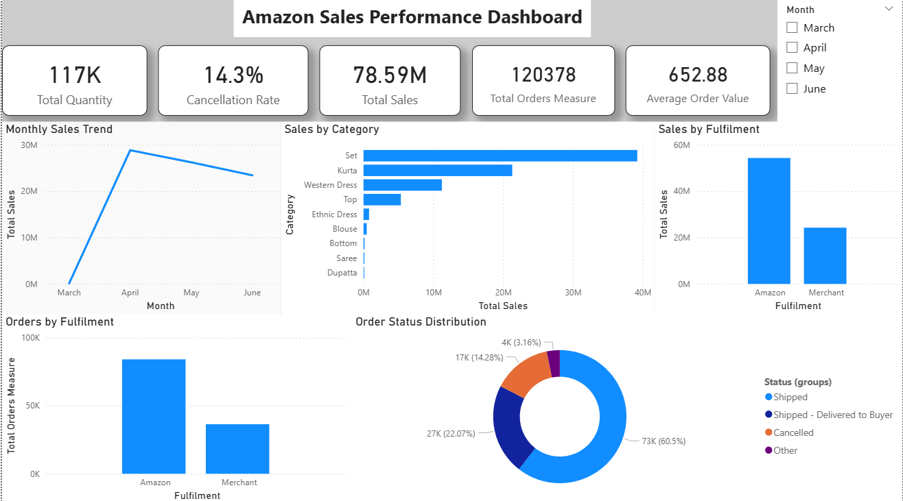

# Amazon Sales Performance Dashboard

## 📊 Project Overview

An interactive Power BI dashboard built to analyze Amazon sales performance, order trends, product categories, fulfilment methods, and order status.

The project demonstrates an end-to-end data analytics workflow, from data cleaning and transformation to data modeling, DAX calculations, and interactive dashboard development.

---

## 🛠️ Tools & Technologies

- Power BI
- Power Query
- DAX
- Data Modeling
- CSV Dataset

---

## 📁 Dataset

The dataset contains Amazon sales transaction records with information including:

- Order ID
- Order Date
- Product Category
- SKU
- Quantity
- Sales Amount
- Fulfilment
- Order Status
- Shipping Location
- Customer/Order information

The dataset contains approximately **128K transaction records**.

---

## 🧹 Data Preparation

The data was prepared using Power Query.

Key steps included:

- Removed unnecessary columns
- Standardized category values
- Corrected data types
- Investigated missing sales amounts
- Validated repeated Order IDs
- Created a dedicated Date table
- Established relationships between tables

---

## 📐 Data Modeling & DAX

Key measures created:

- Total Sales
- Total Quantity
- Total Orders
- Average Order Value
- Cancellation Rate

The project uses `DISTINCTCOUNT(Order ID)` to calculate unique orders because individual orders can contain multiple product lines.

---

## 📈 Dashboard Analysis

The dashboard provides analysis of:

- Monthly Sales Trend
- Sales by Product Category
- Sales by Fulfilment
- Orders by Fulfilment
- Order Status Distribution

### Key KPIs

| KPI | Value |
|---|---:|
| Total Quantity | 117K |
| Total Sales | 78.59M |
| Total Orders | 120,378 |
| Average Order Value | 652.88 |
| Cancellation Rate | 14.3% |

---

## 📸 Dashboard Preview

---

## 🎯 Project Objective

The objective of this project is to transform raw transactional data into an interactive business intelligence dashboard that can help analyze sales performance, order behavior, fulfilment performance, and operational trends.

---

## 👨‍💻 Author

**Saksham Negi**

MBA – AI & Data Science

Aspiring Data Analyst | Business Intelligence | Power BI
